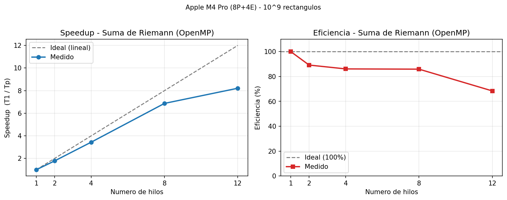
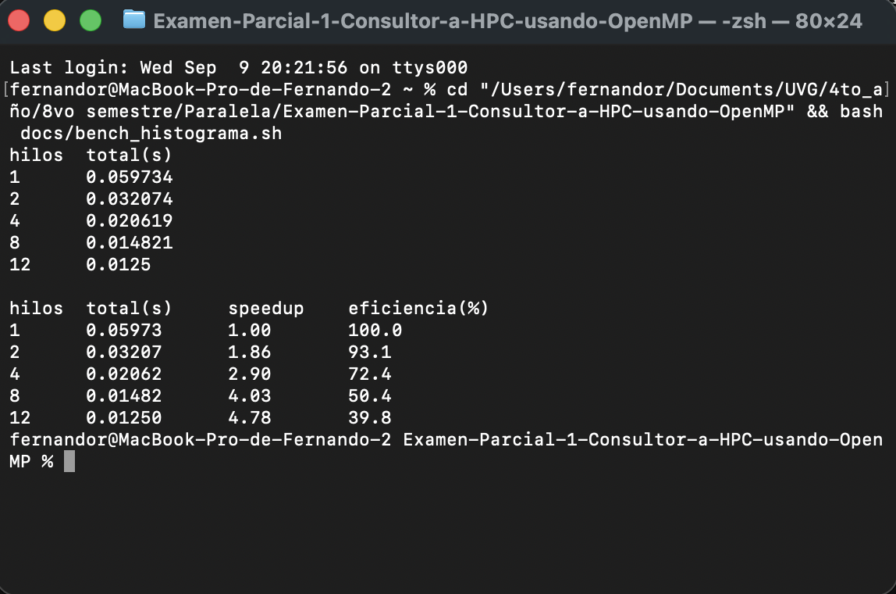

# Resultados y Métricas — Fernando Rueda (23748)

**Consultora HPC:** Los Paralelos
**Máquina de pruebas:** Apple M4 Pro — 12 núcleos (8 de rendimiento + 4 de eficiencia), 24 GB RAM
**Compilador:** `clang` + `libomp` (OpenMP), optimización `-O2`

Mis mediciones cubren los dos problemas de la consultora: la **Suma de Riemann** (que
implementé yo) y el **Histograma** (implementado por mi compañero), corriendo ambos en mi
propia máquina para reportar mi speedup y eficiencia individuales.

En los dos casos el tiempo base **T₁** es el mismo binario paralelo corrido con **1 hilo**,
para que T₁ y Tₚ se midan exactamente igual. Speedup: **S(p) = T₁ / Tₚ**. Eficiencia:
**E(p) = S(p) / p × 100 %**.

---

# 1. Suma de Riemann

**Tamaño del problema:** n = 10⁹ rectángulos, intervalo [0, π], f(x) = x² + sin(x).

## Qué paralelicé y por qué mejora al secuencial

El secuencial recorre los 10⁹ rectángulos en un solo ciclo acumulando el área
(`areaTotal += f(xi) * dx`). Ese es el trabajo que reparto entre hilos con una sola directiva:

```c
#pragma omp parallel for reduction(+:areaTotal) schedule(static)
```

- **`reduction(+:areaTotal)`** — es el corazón del asunto. Si todos los hilos escribieran
  directo sobre `areaTotal` tendría una *race condition*. La reducción le da a cada hilo su
  copia privada, cada uno suma su pedazo, y al final OpenMP junta todo. Descarté
  `#pragma omp critical` porque serializaría la suma y mataría el speedup.
- **`schedule(static)`** — todos los rectángulos cuestan igual, así que el reparto en bloques
  iguales es lo óptimo; un `dynamic` solo agregaría overhead sin beneficio.
- **`omp_get_wtime()` en vez de `clock()`** — `clock()` suma el tiempo de CPU de todos los
  núcleos y daría un speedup falso. `omp_get_wtime()` mide tiempo real de pared.

**Correctitud:** el área da 12.33542554459… en todas las corridas; solo cambian los últimos
dígitos según el número de hilos, por el orden de suma en la reducción. Es normal en punto
flotante y confirma que resuelvo el mismo problema.

## Resultados

Metodología: mejor de 3 corridas por configuración (`bash docs/bench_suma.sh`).

| Hilos | Tiempo (s) | Speedup (T₁/Tₚ) | Eficiencia |
|:-----:|:----------:|:---------------:|:----------:|
| 1     | 2.0979     | 1.00×           | 100.0 %    |
| 2     | 1.1754     | 1.78×           | 89.2 %     |
| 4     | 0.6090     | 3.44×           | 86.1 %     |
| 8     | 0.3054     | 6.87×           | 85.9 %     |
| 12    | 0.2555     | 8.21×           | 68.4 %     |



**Evidencia de corrida** (se ve el comando, mi usuario/máquina y la tabla):


## Análisis

- **De 1 a 8 hilos el escalamiento es casi lineal**: la eficiencia se queda arriba del 85 % y
  paso de ~2.1 s a ~0.31 s (**6.9× más rápido**). La paralelización aprovecha casi todo el
  hardware, justo lo que se espera de un problema grande, uniforme y de reducción pura.
- **La caída a 12 hilos (68.4 %) es de hardware**: el M4 Pro tiene 8 núcleos de rendimiento y
  4 de eficiencia (más lentos). Con 12 hilos los últimos 4 caen en los lentos, así que el
  speedup sigue subiendo (8.21×) pero la eficiencia baja. Es un límite físico, no del código.
- **Por qué nunca llega a 100 %:** siempre hay costo de crear/sincronizar hilos y de juntar la
  reducción. Aun así el resultado es sólido: **hasta 8.2× más rápido que el secuencial**.

---

# 2. Histograma

**Tamaño del problema:** N = 10⁶ mediciones (máximo que permite la implementación,
`#define MAX 1000000`), clasificadas en 100 cubetas.

## Cómo está paralelizado

La versión paralela hace dos cosas antes de reportar: un **merge sort** con tareas y el
**conteo del histograma**. Las directivas clave son:

- **Merge sort con `#pragma omp task` + `taskwait`** — cada mitad de la recursión se lanza
  como una tarea que cualquier hilo puede tomar, con un umbral (`UMBRAL 10000`) para no crear
  tareas de más en segmentos chicos.
- **Histograma con `histLocal[]` privado por hilo + `#pragma omp critical`** — cada hilo cuenta
  en su propio arreglo de 100 cubetas (evita la *race condition*) y al final vuelca su conteo
  al global dentro de un `critical`. Aquí `critical` sí es válido porque solo se ejecuta una
  vez por hilo (100 sumas), no por elemento.

## Resultados

Metodología: mejor de 7 corridas por configuración (`bash docs/bench_histograma.sh`). Reporto
el **tiempo total** del programa (merge sort + histograma), porque el histograma por sí solo
corre en ~2 ms — demasiado rápido para medir un speedup confiable.

| Hilos | Total (s) | Speedup (T₁/Tₚ) | Eficiencia |
|:-----:|:---------:|:---------------:|:----------:|
| 1     | 0.05973   | 1.00×           | 100.0 %    |
| 2     | 0.03207   | 1.86×           | 93.1 %     |
| 4     | 0.02062   | 2.90×           | 72.4 %     |
| 8     | 0.01482   | 4.03×           | 50.4 %     |
| 12    | 0.01250   | 4.78×           | 39.8 %     |


**Evidencia de corrida** (se ve el comando, mi usuario/máquina y la tabla):



## Análisis

- **El speedup se aplana rápido** (4.78× con 12 hilos, eficiencia ~40 %), muy distinto a
  Riemann. Hay tres razones: el trabajo total es chico (~60 ms), así que el costo fijo de crear
  hilos y tareas pesa mucho más; el merge sort tiene una parte **inherentemente secuencial**
  (los `Merge` cerca de la raíz del árbol), lo que limita el speedup por la **Ley de Amdahl**;
  y el `critical` del histograma serializa la combinación final.
- **El histograma en sí escala bien pero es irrelevante en tiempo:** 2 ms → 0.28 ms. En un
  problema tan pequeño, el overhead de paralelizar casi se come la ganancia.

---

# Conclusión

El contraste entre los dos problemas es la lección principal: **la Suma de Riemann escala casi
lineal** (8.2×) porque es un problema grande, de carga uniforme y reducción pura; el
**histograma se aplana** (4.8×, 40 % de eficiencia) porque es pequeño y tiene partes
secuenciales. Paralelizar rinde cuando el trabajo es suficientemente grande y regular —
exactamente el criterio que se espera de una consultora HPC.

---

# Cómo reproducir

```bash
# Suma de Riemann (speedup + eficiencia)
bash docs/bench_suma.sh

# Histograma (speedup + eficiencia)
bash docs/bench_histograma.sh
```

Compilación manual de cada programa:

```bash
# macOS (clang + libomp)
clang -Xpreprocessor -fopenmp -I"$(brew --prefix libomp)/include" \
      -L"$(brew --prefix libomp)/lib" -lomp -O2 paralelo/suma_omp.c -o suma_omp

# Linux (gcc)
gcc -fopenmp -O2 paralelo/suma_omp.c -o suma_omp

./suma_omp 0 3.141592653589793 8              # Riemann:  a  b  num_hilos
echo 1000000 | OMP_NUM_THREADS=8 ./histograma # Histograma: N por stdin, hilos por env
```
