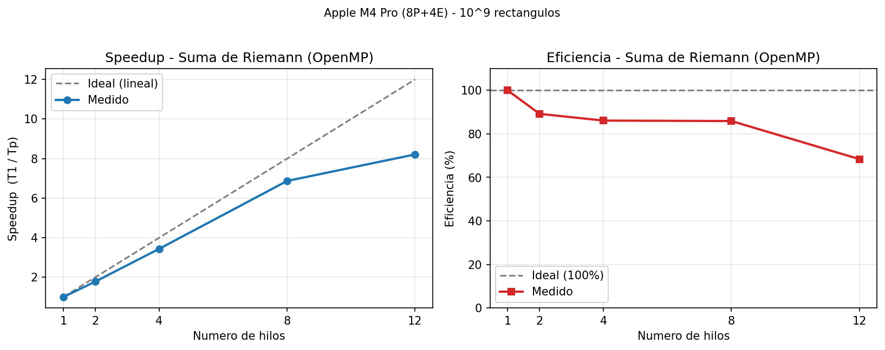
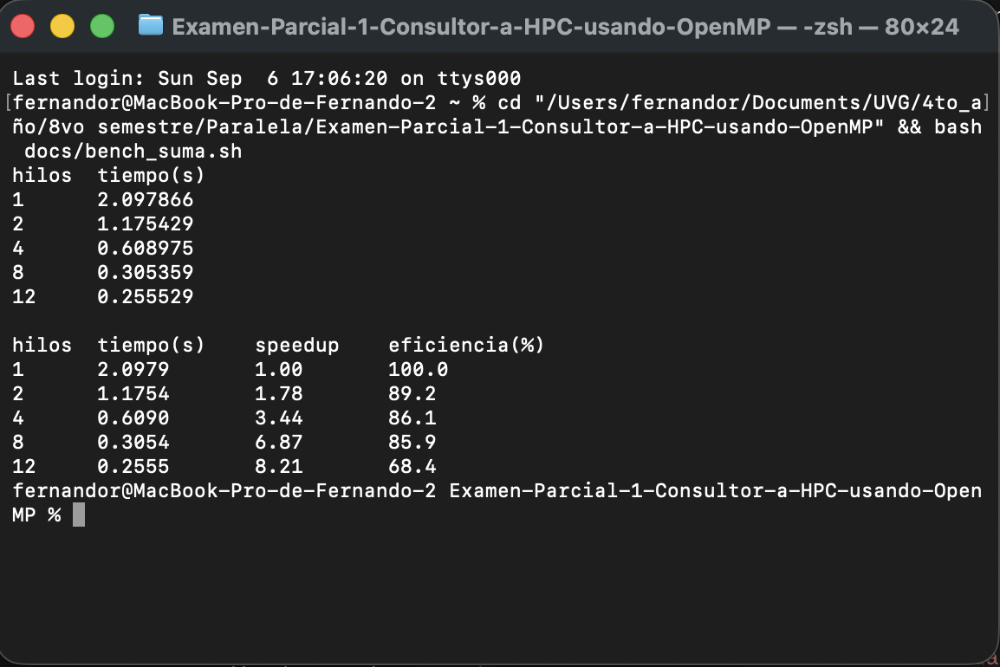
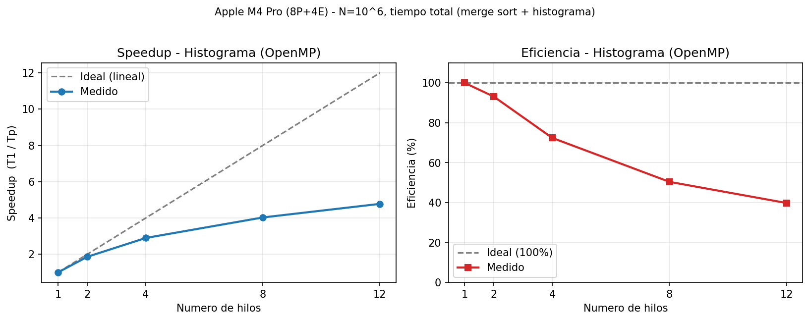

# Resultados y Métricas — Fernando Rueda (23748)

**Consultora HPC:** Los Paralelos
**Máquina de pruebas:** Apple M4 Pro — 12 núcleos (8 de rendimiento + 4 de eficiencia), 24 GB RAM
**Compilador:** `clang` + `libomp` (OpenMP), optimización `-O2`

Aquí presento solo mis métricas de los dos problemas, que corrí en mi propia máquina. El contexto
de los datos y la estrategia de paralelización están en el [Informe General](Informe%20General.md).

En los dos casos tomé como tiempo base **T₁** el mismo programa paralelo corrido con un solo hilo,
así T₁ y Tₚ se miden igual. El speedup es **S(p) = T₁ / Tₚ** y la eficiencia
**E(p) = S(p) / p × 100 %**.

---

# 1. Suma de Riemann

Corrí n = 10⁹ rectángulos en el intervalo [0, π] con f(x) = x² + sin(x), tomando el mejor de 3
tiempos por configuración (`bash docs/bench_suma.sh`).

| Hilos | Tiempo (s) | Speedup (T₁/Tₚ) | Eficiencia |
|:-----:|:----------:|:---------------:|:----------:|
| 1     | 2.0979     | 1.00×           | 100.0 %    |
| 2     | 1.1754     | 1.78×           | 89.2 %     |
| 4     | 0.6090     | 3.44×           | 86.1 %     |
| 8     | 0.3054     | 6.87×           | 85.9 %     |
| 12    | 0.2555     | 8.21×           | 68.4 %     |



**Evidencia de corrida** (se ve el comando, mi usuario y la tabla):



Algo que confirma que todo salió bien es que el área siempre da 12.33542554459…, y solo cambian los
últimos dígitos según cuántos hilos use. Eso pasa porque la reducción suma los términos en distinto
orden, algo normal en punto flotante, así que sé que sigo resolviendo el mismo problema.

### Análisis

De 1 a 8 hilos el escalamiento es casi lineal. La eficiencia se queda arriba del 85 % y el tiempo
baja de ~2.1 s a ~0.31 s, o sea casi 7 veces más rápido. Se nota que la paralelización aprovecha
bien el hardware, que es justo lo que uno espera de un problema grande, parejo y de pura suma.

La caída a 12 hilos (68.4 %) no es culpa del código, sino del hardware. El M4 Pro tiene 8 núcleos
rápidos y 4 de eficiencia más lentos, así que al usar 12 hilos los últimos 4 caen en los lentos. Por
eso el speedup sigue subiendo hasta 8.21× pero la eficiencia baja. Y nunca llega al 100 % porque
siempre hay un costo de crear y sincronizar los hilos y de juntar la reducción al final.

Para asegurarme de que de verdad le gano al secuencial y no solo a mi propia corrida de 1 hilo,
también medí el programa secuencial puro. Me dio 2.19 s, casi lo mismo que mi paralelo con 1 hilo
(2.10 s), así que comparar contra 1 hilo termina siendo prácticamente comparar contra el secuencial.
Contra ese secuencial, mi mejor tiempo (0.26 s con 12 hilos) sale 8.6× más rápido, o sea un 88 %
menos tiempo.

---

# 2. Histograma

Corrí N = 10⁶ mediciones en 100 cubetas, tomando el mejor de 7 tiempos por configuración
(`bash docs/bench_histograma.sh`). Reporto el tiempo total del programa (merge sort + histograma)
porque el histograma solito corre en ~2 ms, demasiado rápido para medir un speedup confiable.

| Hilos | Total (s) | Speedup (T₁/Tₚ) | Eficiencia |
|:-----:|:---------:|:---------------:|:----------:|
| 1     | 0.05973   | 1.00×           | 100.0 %    |
| 2     | 0.03207   | 1.86×           | 93.1 %     |
| 4     | 0.02062   | 2.90×           | 72.4 %     |
| 8     | 0.01482   | 4.03×           | 50.4 %     |
| 12    | 0.01250   | 4.78×           | 39.8 %     |



**Evidencia de corrida** (se ve el comando, mi usuario y la tabla):


### Análisis

Aquí el speedup se aplana rápido, 4.78× con 12 hilos y una eficiencia de apenas ~40 %, muy distinto
a Riemann. Le veo tres razones. El trabajo total es pequeño (~60 ms), así que el costo fijo de crear
los hilos pesa mucho más. El merge sort tiene una parte que va sí o sí en serie (los `Merge` cerca
de la raíz), y eso limita el speedup por la Ley de Amdahl. Y encima el `critical` del histograma
serializa la combinación final.

El histograma en sí escala bien, pero es tan rápido que casi da igual, pasa de 2 ms a 0.28 ms. En un
problema tan pequeño, el overhead de paralelizar casi se come toda la ganancia.

Como en Riemann, comparé también contra el secuencial. El secuencial (0.0597 s) y mi paralelo con 1
hilo (0.0597 s) salieron casi idénticos, así que el speedup da lo mismo se mida como se mida. Contra
el secuencial, mi mejor tiempo (0.0125 s con 12 hilos) es 4.8× más rápido, alrededor de 79 % menos
tiempo.

---

# Conclusión

El contraste entre los dos problemas es lo que más me quedó. La Suma de Riemann escala casi lineal
(8.2×) porque es grande, pareja y de pura suma. El histograma se aplana (4.8× y 40 % de eficiencia)
porque es chico y tiene partes que van en serie. Al final, paralelizar rinde cuando el trabajo es lo
bastante grande y regular.

---

# Cómo reproducir

```bash
bash docs/bench_suma.sh          # Suma de Riemann (speedup + eficiencia)
bash docs/bench_histograma.sh    # Histograma (speedup + eficiencia)
```
