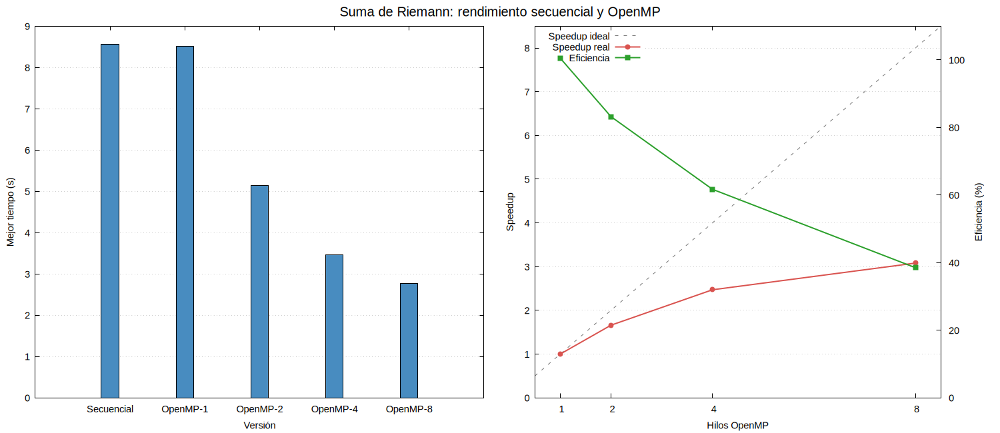
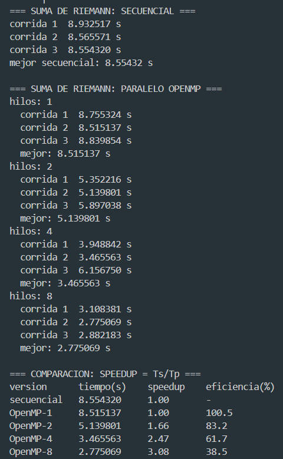
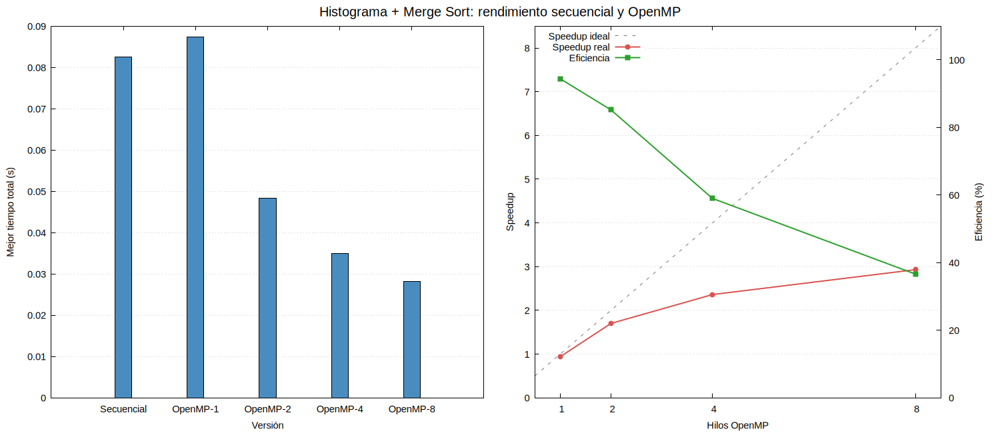
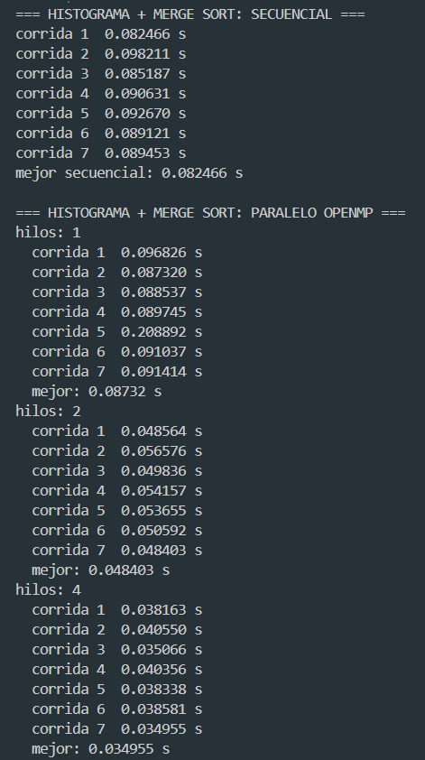
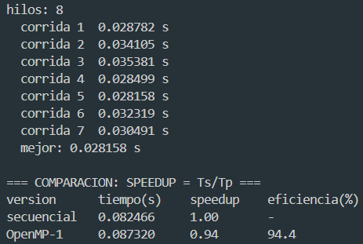

# Resultados y Métricas — Sebastián García (22291)

**Consultora HPC:** Los Paralelos  
**Equipo de pruebas:** Intel Core i5-10300H @ 2.50 GHz, 8 procesadores lógicos  
**Entorno:** GCC bajo WSL, OpenMP y optimización `-O2`  
**Fecha de las pruebas:** 10 de septiembre de 2026

Este informe presenta mis mediciones individuales para los dos problemas seleccionados por la consultora: **Suma de Riemann** e **Histograma de temperaturas con Merge Sort**. En ambos casos se ejecutó el programa secuencial original y luego el programa paralelo con 1, 2, 4 y 8 hilos.

El speedup y la eficiencia se calcularon respecto al mejor tiempo del ejecutable secuencial:

$$
S(p)=\frac{T_s}{T_p}
$$

$$
E(p)=\frac{S(p)}{p}\times100\%
$$

donde $T_s$ es el mejor tiempo secuencial y $T_p$ es el mejor tiempo paralelo con $p$ hilos. Esta metodología compara directamente la solución original con la optimizada. Todas las repeticiones están disponibles en [`sebastian_suma_nueva.txt`](sebastian_suma_nueva.txt) y [`sebastian_histograma_nuevo.txt`](sebastian_histograma_nuevo.txt).

---

## 1. Suma de Riemann

### Problema y datos utilizados

Se aproximó el área bajo la función:

$$
f(x)=x^2+\sin(x)
$$

en el intervalo $[0,\pi]$, utilizando $n=10^9$ rectángulos por el método del extremo izquierdo. Las versiones secuencial y paralela emplean los mismos límites, cantidad de rectángulos, función y temporizador de pared (`omp_get_wtime()`). Los puntos se calculan durante la ejecución y no se almacenan en un arreglo, por lo que el uso adicional de memoria es constante, $O(1)$.

Se realizaron tres corridas por configuración y se tomó el menor tiempo. Ambos programas se compilaron con GCC, `-O2`, `-fopenmp` y `-lm` mediante `docs/bench_suma.sh`.

### Estrategia de paralelización

Cada rectángulo puede calcularse de forma independiente. La versión OpenMP utiliza:

```c
#pragma omp parallel for reduction(+:areaTotal) schedule(static)
```

- `parallel for` distribuye las $10^9$ iteraciones entre los hilos.
- `reduction(+:areaTotal)` proporciona un acumulador privado por hilo y combina las sumas parciales al final. Así evita una condición de carrera sobre `areaTotal` sin serializar cada suma.
- `schedule(static)` es adecuado porque todas las iteraciones realizan prácticamente el mismo trabajo. El reparto anticipado reduce el overhead de planificación.
- `omp_get_wtime()` mide el tiempo real transcurrido en ambas versiones y permite una comparación consistente.

### Resultados

| Versión | Mejor tiempo (s) | Speedup $T_s/T_p$ | Eficiencia |
|:--------|-----------------:|-------------------:|-----------:|
| Secuencial | 8.554320 | 1.00× | — |
| OpenMP — 1 hilo | 8.515137 | 1.00× | 100.5% |
| OpenMP — 2 hilos | 5.139801 | 1.66× | 83.2% |
| OpenMP — 4 hilos | 3.465563 | 2.47× | 61.7% |
| OpenMP — 8 hilos | **2.775069** | **3.08×** | 38.5% |

Para la mejor configuración:

$$
S(8)=\frac{8.554320}{2.775069}=3.08
$$

$$
E(8)=\frac{3.08}{8}\times100=38.5\%
$$

La reducción del tiempo respecto al secuencial fue:

$$
\frac{8.554320-2.775069}{8.554320}\times100=67.6\%
$$

La gráfica siguiente contrasta los tiempos secuencial y paralelos; además muestra el speedup medido frente al ideal y la pérdida de eficiencia al aumentar los hilos:





### Análisis

La paralelización redujo el tiempo de 8.554320 s a 2.775069 s: con ocho hilos, Riemann fue **3.08 veces más rápido** y utilizó **67.6% menos tiempo** que la versión secuencial. Con dos hilos obtuvo 1.66× y 83.2% de eficiencia, el mejor equilibrio entre aprovechamiento de recursos y aceleración. El tiempo continuó bajando con cuatro y ocho hilos, pero la eficiencia disminuyó por el costo de crear y sincronizar el equipo, realizar la reducción final y compartir recursos físicos entre los procesadores lógicos.

La eficiencia de 100.5% con un hilo debe interpretarse como aproximadamente 100%. OpenMP-1 fue solo 0.039183 s más rápido que el secuencial, una diferencia de 0.46%. La frecuencia dinámica del procesador, el estado de la caché, los procesos del sistema y tomar el mejor valor de tres corridas explican esta pequeña variación; no representa una capacidad física superior al 100%.

La variación entre repeticiones, especialmente los 6.156750 s observados en una corrida con cuatro hilos, confirma que hubo interferencia ocasional del sistema. Tomar el mejor tiempo permite aproximarse al rendimiento cuando la máquina estaba menos ocupada, aunque produce una estimación optimista que debe conservarse igual para todas las configuraciones.

---

## 2. Histograma de temperaturas y Merge Sort

### Problema y datos utilizados

Se generaron $N=1,000,000$ temperaturas entre -100 °C y 100 °C, almacenadas en arreglos globales de tipo `float`. Después se ordenaron mediante Merge Sort y se distribuyeron en 100 cubetas. Ambas versiones usan la semilla fija `12345`, por lo que procesan exactamente la misma secuencia de temperaturas.

Se realizaron siete corridas por configuración mediante `docs/bench_histograma.sh` y se tomó el menor tiempo total. La región medida incluye Merge Sort y la construcción del histograma, pero excluye la escritura posterior de CSV, DAT y PNG.

### Estrategia de paralelización

La implementación paralela optimiza las dos etapas principales:

1. **Merge Sort con tareas:** una región `parallel` crea el equipo y `single` inicia una única recursión. Cada mitad independiente se ejecuta mediante `task`; `taskwait` garantiza que ambas mitades terminen antes de combinarlas. El umbral de 10,000 elementos evita crear tareas para segmentos pequeños cuyo overhead superaría el trabajo útil.
2. **Histograma privado por hilo:** `omp for` reparte las temperaturas y cada hilo incrementa su arreglo local de 100 cubetas. Al terminar, una sección `critical` combina los histogramas locales con el global. La sección crítica ocurre una vez por hilo, no una vez por temperatura, lo cual limita la serialización.

`taskwait` evita combinar arreglos todavía desordenados y `critical` elimina la condición de carrera durante la reducción manual de las cubetas.

### Resultados

| Versión | Mejor tiempo total (s) | Speedup $T_s/T_p$ | Eficiencia |
|:--------|-----------------------:|-------------------:|-----------:|
| Secuencial | 0.082466 | 1.00× | — |
| OpenMP — 1 hilo | 0.087320 | 0.94× | 94.4% |
| OpenMP — 2 hilos | 0.048403 | 1.70× | 85.2% |
| OpenMP — 4 hilos | 0.034955 | 2.36× | 59.0% |
| OpenMP — 8 hilos | **0.028158** | **2.93×** | 36.6% |

Para ocho hilos:

$$
S(8)=\frac{0.082466}{0.028158}=2.93
$$

$$
E(8)=\frac{2.93}{8}\times100=36.6\%
$$

La reducción del tiempo fue:

$$
\frac{0.082466-0.028158}{0.082466}\times100=65.9\%
$$

La comparación gráfica permite observar el overhead con un hilo y los rendimientos decrecientes entre cuatro y ocho hilos:







### Análisis

Con un solo hilo, OpenMP fue 5.9% más lento que el ejecutable secuencial debido al overhead de crear regiones paralelas, administrar tareas y ejecutar barreras sin disponer de otro hilo que realice trabajo simultáneo. A partir de dos hilos el costo quedó compensado: el speedup aumentó a 1.70× y la eficiencia fue 85.2%.

La mejor configuración absoluta fue de ocho hilos, con 0.028158 s, un speedup de **2.93×** y una reducción de **65.9%** en el tiempo. Sin embargo, el aumento de cuatro a ocho hilos solo redujo 0.006797 s y la eficiencia cayó de 59.0% a 36.6%, mostrando rendimientos decrecientes.

El Histograma escala menos que Riemann porque su región medida dura solo decenas de milisegundos y el overhead representa una proporción mayor. Además, las combinaciones de Merge Sort son seriales en cada nivel, existen barreras entre dependencias y la reducción final atraviesa una sección crítica. De acuerdo con la Ley de Amdahl, estas partes seriales limitan el speedup aunque aumente el número de hilos. La corrida atípica de 0.208892 s con un hilo también evidencia la influencia de procesos externos en mediciones tan breves.

---

## 3. Comparación general y conclusión

| Algoritmo | Secuencial | Mejor configuración | Mejor tiempo | Speedup | Reducción del tiempo |
|:----------|-----------:|--------------------:|-------------:|--------:|---------------------:|
| Suma de Riemann | 8.554320 s | 8 hilos | 2.775069 s | 3.08× | 67.6% |
| Histograma + Merge Sort | 0.082466 s | 8 hilos | 0.028158 s | 2.93× | 65.9% |

Los resultados demuestran que paralelizar no consiste únicamente en aumentar la cantidad de hilos. Riemann ofrece más trabajo uniforme e independiente y alcanzó 3.08× de aceleración. Histograma también mejoró de forma clara, pero sus tareas, barreras, combinaciones seriales y corta duración limitaron antes su escalabilidad.

Las directivas elegidas evitaron condiciones de carrera sin serializar el trabajo dominante: `reduction` protegió la suma de Riemann, mientras que las tareas con umbral y los histogramas privados permitieron dividir el segundo algoritmo. En esta máquina, ocho hilos produjeron el menor tiempo para ambos problemas, pero dos hilos conservaron la mayor eficiencia después de la configuración base.

## Reproducción

```bash
bash docs/bench_suma.sh | tee docs/sebastian_suma_nueva.txt
bash docs/bench_histograma.sh | tee docs/sebastian_histograma_nuevo.txt
```
